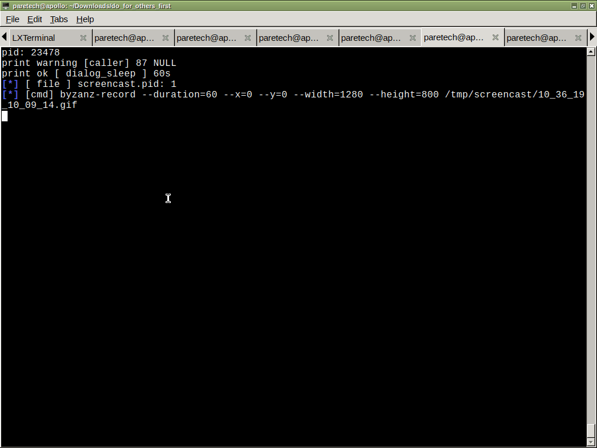

MENU.YAML 
===
- a simple parser for creating a menu out of a single yaml file.

how to use
===
- describe your menu in: menu.yaml

recommended:
==
- triggered pilot.sh by the key-combination: Alt+f1

Demo
==

